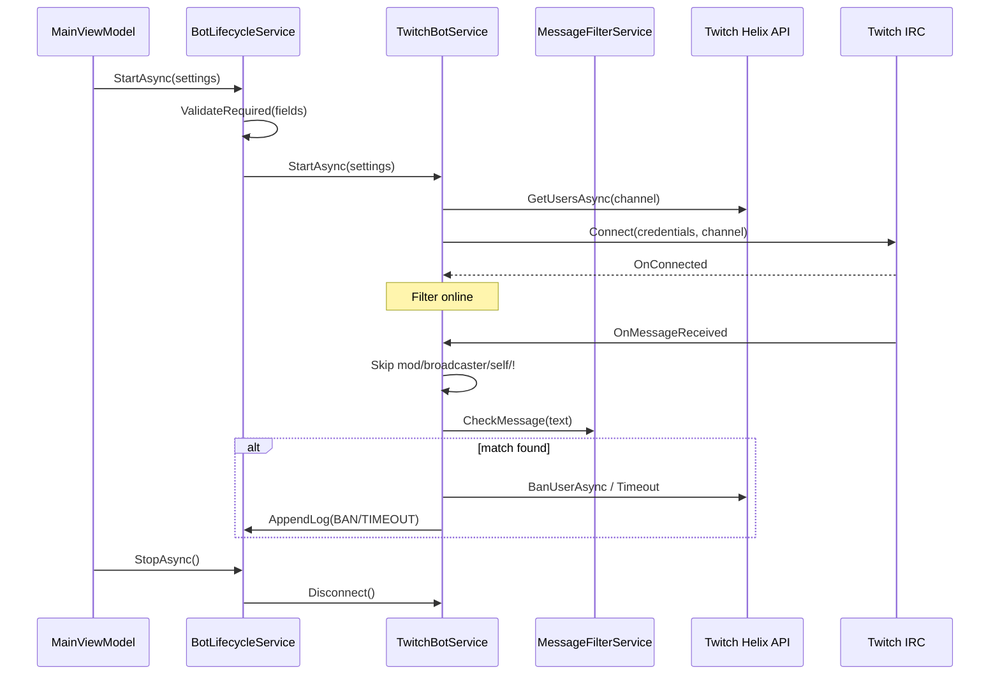

# Ban Words Filter — macOS (Apple Silicon)

Десктопное приложение для Twitch-стримеров: автоматическая модерация чата по списку запрещённых слов и фраз. Работает от имени аккаунта стримера, без отдельного бот-аккаунта. Все настройки и токены хранятся только локально на Mac.

> **Платформа:** macOS 12+ (Monterey и новее), Apple Silicon (`osx-arm64`)  
> **Стек:** .NET 8, Avalonia UI 12, TwitchLib  
> **Версия:** 1.0.0

---

## Содержание

- [Что внутри репозитория](#что-внутри-репозитория)
- [Структура DMG-установщика](#структура-dmg-установщика)
- [Анатомия .app-бандла](#анатомия-app-бандла)
- [Архитектура приложения](#архитектура-приложения)
- [Движок фильтрации](#движок-фильтрации)
- [Интеграция с Twitch](#интеграция-с-twitch)
- [Хранение данных](#хранение-данных)
- [Пользовательский интерфейс](#пользовательский-интерфейс)
- [Сборка из исходников](#сборка-из-исходников)
- [Установка для конечного пользователя](#установка-для-конечного-пользователя)
- [Требования Twitch API](#требования-twitch-api)
- [Безопасность](#безопасность)
- [Лицензия и контакты](#лицензия-и-контакты)

---

## Что внутри репозитория

```
Filter Apple GitHub/
├── README.md                          # Этот файл
├── .gitignore
├── src/
│   └── BanWordsFilter/                # Исходный код приложения (C# / Avalonia)
│       ├── Program.cs                 # Точка входа
│       ├── ViewModels/                # MVVM-слой (MainViewModel)
│       ├── Services/                  # Бизнес-логика (бот, фильтр, настройки)
│       ├── Models/                    # DTO и модели данных
│       ├── Views/                     # Окна и диалоги (AXAML)
│       ├── Resources/
│       │   ├── banned-words.json      # Словарь запрещённых слов (embedded)
│       │   └── SetupInstructions.txt  # Встроенная инструкция
│       └── Assets/                    # Иконка приложения
├── tools/
│   ├── build_mac_app.sh               # Сборка .app из исходников
│   └── build_installer.sh             # Упаковка .app в DMG
```

| Папка | Назначение |
|-------|-----------|
| `src/` | Исходники для разработки и пересборки |
| `tools/` | Скрипты сборки macOS-версии |

---

## Структура DMG-установщика

DMG (`Ban Words Filter Installer.dmg`) — стандартный macOS-образ диска в формате **UDZO** (сжатый read-only). При монтировании появляется том с именем **«Ban Words Filter»**.

### Содержимое тома

```
/Volumes/Ban Words Filter/
├── Ban Words Filter.app    # Приложение (перетащить в Applications)
└── Applications            # Симлинк → /Applications
```

### Как создаётся DMG

Скрипт `tools/build_installer.sh` выполняет:

1. Проверяет наличие собранного `Ban Words Filter.app`
2. Создаёт временную staging-папку
3. Копирует `.app` в staging
4. Создаёт симлинк `Applications → /Applications`
5. Вызывает `hdiutil create` с параметрами:
   - `-volname "Ban Words Filter"` — имя тома
   - `-format UDZO` — сжатый образ
   - `-srcfolder` — staging-папка как источник

Пользователь открывает DMG, перетаскивает `.app` на иконку **Applications** — стандартный паттерн установки macOS без инсталлятора.

### Монтирование и распаковка вручную

```bash
# Смонтировать DMG
hdiutil attach "Ban Words Filter Installer.dmg" -nobrowse -readonly

# Содержимое появится в /Volumes/Ban Words Filter/
ls -la "/Volumes/Ban Words Filter/"

# Размонтировать
hdiutil detach "/Volumes/Ban Words Filter"
```

---

## Анатомия .app-бандла

`Ban Words Filter.app` — macOS Application Bundle. Это каталог с фиксированной внутренней структурой:

```
Ban Words Filter.app/
└── Contents/
    ├── Info.plist              # Метаданные бандла (имя, версия, executable)
    ├── MacOS/                  # Исполняемые файлы и runtime
    │   ├── BanWordsFilter      # Главный native executable (.NET host)
    │   ├── BanWordsFilter.dll  # Скомпилированная сборка приложения
    │   ├── Avalonia*.dll       # UI-фреймворк
    │   ├── TwitchLib*.dll      # Twitch IRC + Helix API
    │   ├── libcoreclr.dylib    # .NET CoreCLR runtime
    │   ├── libSkiaSharp.dylib  # Рендеринг UI
    │   └── ... (~200 файлов)   # Self-contained .NET 8 runtime
    └── Resources/
        └── AppIcon.icns        # Иконка в Dock / Finder
```

### Info.plist — ключевые поля

| Ключ | Значение | Описание |
|------|----------|----------|
| `CFBundleExecutable` | `BanWordsFilter` | Имя бинарника в `MacOS/` |
| `CFBundleIdentifier` | `local.banwordsfilter.app` | Уникальный ID бандла |
| `CFBundleShortVersionString` | `1.0.0` | Версия для пользователя |
| `CFBundleVersion` | `1` | Build number |
| `LSMinimumSystemVersion` | `12.0` | Минимальная macOS |
| `NSHighResolutionCapable` | `true` | Поддержка Retina |

### Self-contained deployment

Приложение собрано с флагом `--self-contained true` для `osx-arm64`. Это значит:

- **Не требуется** установленный .NET на машине пользователя
- Весь runtime (.NET 8 CoreCLR, BCL, native libs) упакован внутрь `MacOS/`
- Размер `.app` ~107 МБ (типично для self-contained Avalonia-приложения)
- Работает только на **Apple Silicon** (M1/M2/M3/M4). Для Intel Mac нужна отдельная сборка `osx-x64`

---

## Архитектура приложения

Приложение построено по паттерну **MVVM** (Model–View–ViewModel) на фреймворке **Avalonia UI**.

```
┌─────────────────────────────────────────────────────────────┐
│  Views (AXAML)                                              │
│  MainWindow, InstructionsWindow, ConfirmDialogs             │
└──────────────────────────┬──────────────────────────────────┘
                           │ data binding
┌──────────────────────────▼──────────────────────────────────┐
│  MainViewModel                                              │
│  Команды UI, статус, лог, тест фильтра                      │
└──────────────────────────┬──────────────────────────────────┘
                           │
┌──────────────────────────▼──────────────────────────────────┐
│  BotLifecycleService          ← единая точка оркестрации    │
│  ├── SettingsService          ← config.json на диске        │
│  ├── TokenValidationService   ← Twitch OAuth validate       │
│  ├── MessageFilterService     ← движок фильтрации           │
│  └── TwitchBotService         ← IRC + Helix moderation      │
└─────────────────────────────────────────────────────────────┘
```

### Слои и ответственность

| Компонент | Файл | Роль |
|-----------|------|------|
| `Program` | `Program.cs` | Запуск Avalonia desktop lifetime |
| `MainViewModel` | `ViewModels/MainViewModel.cs` | Связка UI ↔ сервисы, команды, polling лога |
| `BotLifecycleService` | `Services/BotLifecycleService.cs` | Start/Stop бота, сохранение настроек, тест фильтра |
| `TwitchBotService` | `Services/TwitchBotService.cs` | IRC-подключение к чату, обработка сообщений, ban/timeout |
| `MessageFilterService` | `Services/MessageFilterService.cs` | Нормализация текста, сопоставление со словарём |
| `SettingsService` | `Services/SettingsService.cs` | CRUD `config.json`, нормализация OAuth-токена |
| `TokenValidationService` | `Services/TokenValidationService.cs` | Проверка токена через Twitch API |
| `BotDirectory` | `Services/BotDirectory.cs` | Путь к папке данных пользователя |

### Жизненный цикл бота



### Пропуск сообщений (не модерируются)

`TwitchBotService.OnMessageReceived` игнорирует:

- Сообщения **модераторов** (`message.IsModerator`)
- Сообщения **владельца канала** (`message.IsBroadcaster`)
- Сообщения **самого бота** (сравнение `Username` с `TwitchBotName`)
- Сообщения, начинающиеся с **`!`** (команды чата)

---

## Движок фильтрации

Словарь запрещённых слов встроен в сборку как **Embedded Resource** (`Resources/banned-words.json`). При старте `MessageFilterService` десериализует JSON в `BannedWordsConfig`.

### Категории контента

Словарь ориентирован на **нарушения правил Twitch** (hate speech, slurs, угрозы, CSAM). Обычный мат **не** входит в список.

Примеры категорий:

| Категория | Severity | Action | Описание |
|-----------|----------|--------|----------|
| `homophobic_transphobic_ru` | critical | `instant_ban` | Гомофобные/трансфобные оскорбления (RU) |
| `homophobic_transphobic_en` | critical | `instant_ban` | То же (EN) |
| `racial_ethnic_slurs` | critical | `instant_ban` | Расовые этнические slurs |
| `threats_violence` | high | `timeout_or_ban` | Угрозы насилия |
| ... | ... | ... | ... |

Каждая категория содержит:

- `exact` — точные строки для поиска подстроки
- `regex` — регулярные выражения для обходов написания
- `action` — переопределяет глобальное действие из `meta`

### Приоритет действий

При нескольких совпадениях выбирается совпадение с наивысшим приоритетом:

```
instant_ban (3) > ban (2) > timeout_or_ban (1) > timeout (0)
```

### Нормализация текста

Перед сравнением сообщение проходит многоступенчатую нормализацию (`NormalizeText` / `NormalizeVariants`):

1. **Lowercase** — приведение к нижнему регистру
2. **Strip zero-width** — удаление невидимых Unicode-символов (`\u200b`, `\u200d`, `\ufeff`, `\u00ad`)
3. **Homoglyph map** — замена кириллицы на латинские аналоги (`а→a`, `р→r`, `і→i` и т.д.)
4. **Leetspeak** — замена цифр и символов на буквы (`0→o`, `1→i`, `@→a`, `$→s`)
5. **Remove chars** — удаление пробелов, пунктуации, разделителей
6. **Collapse repeated chars** — схлопывание повторов (`пиииидор` → `пиidor` с max=2)

Генерируются **два варианта** нормализации (с/без полного homoglyph-прохода) — оба проверяются против словаря.

### Whitelist

Список `whitelist.exact` — фразы, которые **никогда** не триггерят фильтр (ложноположительные совпадения).

### Тест фильтра

Вкладка «Тест» вызывает `MessageFilterService.CheckMessage()` локально, **без** отправки в Twitch. Показывает: забанить ли, действие, до 5 совпадений с категорией и паттерном.

---

## Интеграция с Twitch

### OAuth 2.0 Implicit Grant

Приложение использует **Implicit Grant Flow** (токен в URL-фрагменте):

```
https://id.twitch.tv/oauth2/authorize
  ?client_id={CLIENT_ID}
  &redirect_uri=http://localhost
  &response_type=token
  &scope=chat:read chat:edit moderator:manage:banned_users user:bot
```

Пользователь копирует `access_token` из адресной строки браузера после авторизации. `SettingsService.NormalizeOAuthToken()` умеет извлекать токен из полной URL-строки или формата `oauth:TOKEN`.

### Обязательные scopes

| Scope | Назначение |
|-------|-----------|
| `chat:read` | Чтение сообщений чата (IRC) |
| `chat:edit` | Отправка сообщений в чат |
| `moderator:manage:banned_users` | Ban и timeout через Helix API |
| `user:bot` | Работа бота от имени стримера (Chat Bot Badge) |

Проверка: `TokenValidationService` вызывает `GET https://id.twitch.tv/oauth2/validate` и сверяет scopes.

### IRC-подключение (TwitchLib.Client)

```
ConnectionCredentials(botName, oauthToken)
→ TwitchClient.Initialize(credentials, channel)
→ TwitchClient.Connect()
```

- Подключение к каналу стримера по имени (`TWITCH_CHANNEL`)
- Обработчик `OnMessageReceived` — основной pipeline модерации

### Helix API (TwitchLib.Api)

Для модерации используется **Ban User** endpoint:

```csharp
_api.Helix.Moderation.BanUserAsync(
    broadcasterId,    // ID канала (получен через GetUsersAsync)
    moderatorId,      // TWITCH_BOT_ID (ID стримера)
    new BanUserRequest {
        UserId = userId,
        Reason = "Auto-mod (категория)",
        Duration = timeoutSeconds  // только для timeout
    }
);
```

- **Permanent ban** — `BanUserRequest` без `Duration`
- **Timeout** — `Duration` в секундах (по умолчанию 600, настраивается в `TIMEOUT_SECONDS`)
- Для `timeout_or_ban`: если `TimeoutSeconds > 0` → timeout, иначе → ban

---

## Хранение данных

Все пользовательские данные хранятся локально:

```
~/Library/Application Support/Ban Words Filter/
├── config.json       # Twitch credentials и настройки
└── startup.log       # Лог запуска (если есть)
```

### config.json

```json
{
  "TWITCH_TOKEN": "oauth:xxxxxxxx",
  "TWITCH_CLIENT_ID": "...",
  "TWITCH_CLIENT_SECRET": "...",
  "TWITCH_BOT_NAME": "channel_name",
  "TWITCH_BOT_ID": "12345678",
  "TWITCH_CHANNEL": "channel_name",
  "TIMEOUT_SECONDS": "600"
}
```

- Токены **не** отправляются на сторонние серверы
- Единственные внешние запросы — к API Twitch (`id.twitch.tv`, `api.twitch.tv`, IRC)
- Кнопка «Удалить всё» (`ClearAllAsync`) удаляет `config.json` и логи

---

## Пользовательский интерфейс

Avalonia UI с темой **Fluent**, шрифт **Inter**. Три вкладки:

| Вкладка | Функции |
|---------|---------|
| **Настройки** | Поля Twitch API, OAuth, проверка токена, Старт/Стоп |
| **Тест** | Локальная проверка фразы против фильтра |
| **Лог** | Журнал событий (обновляется каждую секунду) |

Дополнительные окна:

- `InstructionsWindow` — встроенная пошаговая инструкция (`SetupInstructions.txt`)
- `ConfirmChatTestDialog` — подтверждение тестового сообщения в чат
- `ConfirmClearAllDialog` — подтверждение удаления всех данных

---

## Сборка из исходников

### Требования

- macOS 12+
- Apple Silicon Mac (для целевой платформы `osx-arm64`)
- [.NET 8 SDK](https://dotnet.microsoft.com/download/dotnet/8.0) или `brew install dotnet@8`

### Шаг 1 — Сборка .app

```bash
cd "Filter Apple GitHub"
bash tools/build_mac_app.sh
```

Скрипт:

1. Запускает `dotnet publish -c Release -r osx-arm64 --self-contained true`
2. Создаёт `dist/Ban Words Filter/Ban Words Filter.app`
3. Копирует publish-артефакты в `Contents/MacOS/`
4. Генерирует `Info.plist`
5. Копирует `AppIcon.icns` в `Contents/Resources/`

> **Примечание:** скрипты по умолчанию ожидают корень проекта на уровень выше `tools/`. При запуске из этой папки пути уже настроены корректно (`ROOT = dirname(tools)/..`).

### Шаг 2 — Создание DMG

```bash
bash tools/build_installer.sh
```

Результат: `Ban Words Filter Installer.dmg` (в корне проекта, после `bash tools/build_installer.sh`)

### Запуск без установки

```bash
# после сборки:
open "dist/Ban Words Filter/Ban Words Filter.app"
```

### Первый запуск и Gatekeeper

Приложение не подписано Apple Developer ID. macOS может показать предупреждение. Обход:

```bash
xattr -cr "/Applications/Ban Words Filter.app"
```

Или: **Системные настройки → Конфиденциальность и безопасность → Всё равно открыть**.

---

## Установка для конечного пользователя

1. Скачать `Ban Words Filter Installer.dmg`
2. Открыть DMG двойным кликом
3. Перетащить **Ban Words Filter.app** на папку **Applications**
4. Запустить из Launchpad или `/Applications/`
5. Следовать встроенной инструкции (кнопка «Инструкция» в приложении)

---

## Требования Twitch API

1. Аккаунт стримера с включённой **2FA**
2. Приложение на [dev.twitch.tv/console](https://dev.twitch.tv/console)
3. **OAuth Redirect URL:** `http://localhost` (именно `http`, не `https`)
4. Client ID и Client Secret → в поля приложения
5. OAuth Token с scopes: `chat:read`, `chat:edit`, `moderator:manage:banned_users`, `user:bot`

---

## Безопасность

- Токены хранятся только в `~/Library/Application Support/Ban Words Filter/config.json`
- Нет телеметрии, аналитики, облачных серверов
- Сетевые запросы только к `*.twitch.tv`
- `banned-words.json` встроен в бинарник — пользователь не может случайно удалить словарь
- Client Secret нужен для регистрации приложения на Twitch; в runtime используется преимущественно для TwitchLib, но **не передаётся** третьим лицам

---

## Лицензия и контакты

- **Автор:** [taganovv](https://github.com/taganovv)
- **Twitch:** [twitch.tv/taganovv](https://www.twitch.tv/taganovv)

---

## Зависимости (NuGet)

| Пакет | Версия | Назначение |
|-------|--------|-----------|
| Avalonia | 12.0.4 | Кроссплатформенный UI |
| Avalonia.Desktop | 12.0.4 | Desktop host (macOS) |
| Avalonia.Themes.Fluent | 12.0.4 | Fluent Design тема |
| Avalonia.Fonts.Inter | 12.0.4 | Шрифт Inter |
| TwitchLib.Api | 3.10.2 | Twitch Helix REST API |
| TwitchLib.Client | 3.3.1 | Twitch IRC client |
