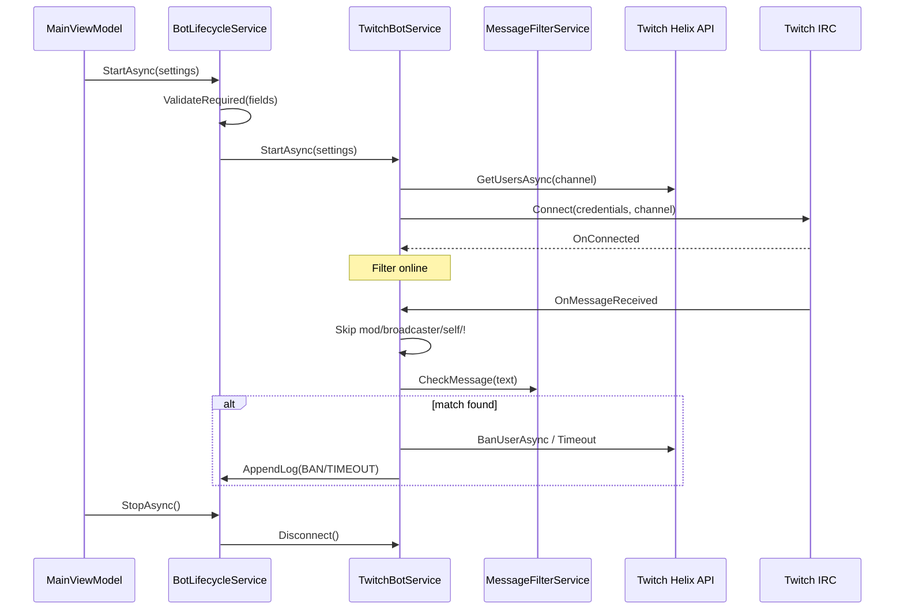

# Ban Words Filter

Программа для Twitch-стримеров: следит за чатом и автоматически убирает зрителей, которые пишут запрещённые слова и оскорбления.

---

## Как это работает

**Ban Words Filter** подключается к чату вашего канала от вашего имени — отдельный бот-аккаунт не нужен. Вы один раз вводите данные из [dev.twitch.tv](https://dev.twitch.tv/console), нажимаете «Старт» — и программа начинает работать, пока открыта на компьютере.

## Почему Ban Words Filter, а не NightBot / Moobot / StreamElements

Ban Words Filter — не универсальный чат-бот с командами, розыгрышами и оверлеями. Это **узкоспециализированный инструмент автомодерации**: он ловит в чате то, за что Twitch реально банит канал — hate speech, slurs, угрозы, CSAM и подобное. Обычный мат в список **не входит**.

### Главные отличия

| | Ban Words Filter | NightBot / Moobot / StreamElements |
|---|---|---|
| **Задача** | Только защита канала от ToS-нарушений | Широкий набор: команды, таймеры, розыгрыши, алерты |
| **Аккаунт** | Работает от **вашего** аккаунта стримера — отдельный бот-аккаунт не нужен | Обычно отдельный бот или привязка через сторонний сервис |
| **Данные** | Токены и настройки **только на вашем компьютере** | Настройки и логика — в облаке сервиса |
| **Стоимость** | **Бесплатно** | Бесплатный тариф с ограничениями; расширенные функции — по подписке |
| **Зависимость** | Локальное приложение, без привязки к аптайму чужого сервиса | Если сервис лежит или API недоступен — функции бота могут отвалиться |
| **Фокус фильтра** | Словарь заточен под **правила Twitch**, а не «запретить слово X» | Чёрный список слов есть, но без глубокой анти-обходной нормализации |
| **Обходы написания** | Homoglyphs (кириллица ↔ латиница), leetspeak, zero-width символы, схлопывание повторов, regex | Как правило — простое совпадение по словам |
| **Действия** | Автоматический **ban / timeout** через Twitch Helix API | Зависит от сервиса; не всегда мгновенный бан |
| **Тестирование** | Встроенная вкладка «Тест фильтра» — проверка **без** отправки в чат | Нужно тестировать вживую в стриме или вручную |
| **Многоканальность** | В настройках есть поле "Модерируемый канал", туда можно вписать любой канал, на котором вы являетесь модератором, программа будет работать | В большинстве сервисов каждый канал это отдельная плата и отдельное подключение |
| **Прозрачность** | Открытый словарь `banned-words.json`, можно посмотреть и изменить в исходниках | Чёрный список и логика — на стороне сервиса |

### Что это даёт на практике

**1. Защита канала, а не «ещё один бот в чате»**  
NightBot и StreamElements — швейцарские ножи. Ban Words Filter делает одну вещь, но основательно: не даёт токсичному сообщению повисеть в чате, пока вы или моды не заметите.

**2. Без лишнего бот-аккаунта**  
Не нужно заводить отдельный Twitch-аккаунт, выдавать ему модку и следить, чтобы он не отвалился. Бот работает с правами **вашего** канала.

**3. Приватность**  
OAuth-токен и конфиг лежат локально в папке приложения. Ничего не уходит на чужие серверы — в отличие от облачных ботов, где настройки хранятся у провайдера.

**4. Устойчивость к обходам**  
Зритель напишет запрещенное слово с невидимым символом `пример: п-в0рд` или пролонагацию `пример: п-воооорд` — фильтр нормализует текст и всё равно поймает совпадение. У типичных списков запрещённых слов в облачных ботах такой глубины обработки нет.

**5. Не мешает остальным ботам**  
Сообщения с `!` (команды NightBot, Moobot и т.д.) фильтр **игнорирует**. Можно оставить любимого бота для команд и параллельно включить Ban Words Filter только для модерации.

**6. Бесплатно и без подписок**  
Программа распространяется **бесплатно**. Нет платных тарифов, лимитов на количество правил или «премиум-модерации».

### Кому подойдёт

- Стримерам, которым нужна **автоматическая защита от ToS-нарушений**, а не полноценная экосистема бота
- Тем, кто не хочет отдавать токены и настройки третьим сервисам
- Каналам с активным RU/EN-чатом, где зрители пытаются обходить фильтры через транслит и leetspeak

### Когда лучше оставить NightBot / StreamElements

Если вам нужны команды чата, таймеры, розыгрыши, интеграция с донатами и оверлеями — облачные боты для этого и созданы. Ban Words Filter **не заменяет** их полностью, а **дополняет** или заменяет только слой автомодерации — при этом бесплатно и локально.

### Что делает программа

- **Следит за чатом** на вашем канале в реальном времени.
- **Находит запрещённые слова и фразы** — оскорбления, hate speech, угрозы и другой контент, который нарушает правила Twitch. Обычный мат в список не входит.
- **Убирает нарушителя из чата** — банит или даёт тайм-аут (в зависимости от типа нарушения).
- **Распознаёт хитрые написания** — когда зритель пытается обойти фильтр: лишние буквы, замены символов, смешение русского и латиницы и т.п.
- **Хранит настройки только у вас на компьютере** — токены и ключи никуда не отправляются, кроме самого Twitch.

### Что умеет

- **Настройки** — ввод Client ID, Client Secret, OAuth-токена; проверка токена одной кнопкой; получение токена через браузер.
- **Старт и стоп** — включили перед стримом, выключили после. Закрыли программу — фильтр перестал работать.
- **Тест фильтра** — можно проверить любую фразу и увидеть, сработает ли бан, ещё до стрима.
- **Лог** — что происходило: подключение, срабатывания, ошибки.
- **Удалить всё** — сбросить сохранённые настройки на этом компьютере.

### Как пользоваться (коротко)

1. Создайте приложение на [dev.twitch.tv](https://dev.twitch.tv/console) и укажите Redirect URL: `http://localhost`
2. Вставьте Client ID и Client Secret в программу.
3. Получите OAuth-токен (кнопка в программе) и нажмите «Проверить токен».
4. Сохраните настройки и нажмите **▶ Старт**.
5. В чате появится сообщение, что фильтр включён.

Подробная пошаговая инструкция есть внутри программы — кнопка «Инструкция».

---

## Что под капотом?

# Ban Words Filter — Windows

Десктопное приложение для Twitch-стримеров: автоматическая модерация чата по списку запрещённых слов и фраз. Работает от имени аккаунта стримера, без отдельного бот-аккаунта. Все настройки и токены хранятся только локально на компьютере.

> **Платформа:** Windows 10 и новее, 64-bit (`win-x64`)  
> **Стек:** .NET 8, Avalonia UI 12, TwitchLib, NSIS  
> **Версия:** 1.0.0

---

## Содержание

- [Что внутри репозитория](#что-внутри-репозитория)
- [Структура NSIS-установщика](#структура-nsis-установщика)
- [Анатомия собранного приложения](#анатомия-собранного-приложения)
- [Архитектура приложения](#архитектура-приложения)
- [Движок фильтрации](#движок-фильтрации)
- [Интеграция с Twitch](#интеграция-с-twitch)
- [Хранение данных](#хранение-данных)
- [Пользовательский интерфейс](#пользовательский-интерфейс)
- [Сборка из исходников](#сборка-из-исходников)
- [Установка для конечного пользователя](#установка-для-конечного-пользователя)
- [Требования Twitch API](#требования-twitch-api)
- [Безопасность](#безопасность)
- [Лицензия и контакты](#лицензия-и-контакты)

---

## Что внутри репозитория

```
Filter Windows GitHub/
├── README.md                          # Этот файл
├── .gitignore
├── src/
│   └── BanWordsFilter/                # Исходный код приложения (C# / Avalonia)
│       ├── Program.cs                 # Точка входа
│       ├── ViewModels/                # MVVM-слой (MainViewModel)
│       ├── Services/                  # Бизнес-логика (бот, фильтр, настройки)
│       ├── Models/                    # DTO и модели данных
│       ├── Views/                     # Окна и диалоги (AXAML)
│       ├── Resources/
│       │   ├── banned-words.json      # Словарь запрещённых слов (embedded)
│       │   └── SetupInstructions.txt  # Встроенная инструкция
│       ├── Assets/                    # Иконка приложения (PNG → ICO при сборке)
│       └── app.manifest               # Манифест совместимости Windows 10+
└── tools/
    ├── build_windows_app.sh           # dotnet publish win-x64
    ├── prepare_windows_installer.sh   # Подготовка payload для NSIS
    ├── build_windows_installer.sh     # Полный пайплайн → Setup.exe
    ├── generate_app_icon.py           # Конвертация PNG → ICO
    └── windows/
        ├── installer.nsi              # Скрипт NSIS-установщика
        └── build_installer.ps1        # Сборка на Windows через PowerShell
```

| Папка | Назначение |
|-------|-----------|
| `src/` | Исходники для разработки и пересборки |
| `tools/` | Скрипты сборки Windows-версии и NSIS-инсталлятора |

> Готовый `Ban Words Filter Setup.exe` (~70 МБ) в репозиторий **не входит** — это бинарный артефакт сборки. Чтобы скачать приложение перейдите во вкладку релизы, там есть установщик.

---

## Структура NSIS-установщика

`Ban Words Filter Setup.exe` — самораспаковывающийся установщик на базе **Nullsoft Scriptable Install System (NSIS)**. Формат: PE32 GUI, Unicode, требует прав администратора (`RequestExecutionLevel admin`).

### Что происходит при установке

1. **Приветствие** — стандартная страница MUI Welcome
2. **Выбор папки** — по умолчанию `%ProgramFiles%\Ban Words Filter`
3. **Дополнительные параметры** — кастомная страница: чекбокс «Создать ярлык на рабочем столе» (включён по умолчанию)
4. **Установка файлов** — копирование payload в `$INSTDIR`
5. **Завершение** — страница Finish

### Куда устанавливается

```
C:\Program Files\Ban Words Filter\
├── BanWordsFilter.exe          # Главный исполняемый файл
├── app-icon.ico                # Иконка для ярлыков
├── Avalonia*.dll               # UI-фреймворк
├── TwitchLib*.dll            # Twitch IRC + Helix API
├── *.dll                       # Self-contained .NET 8 runtime (~200 файлов)
└── Uninstall.exe               # Деинсталлятор (создаётся установщиком)
```

### Записи в реестре

Установщик регистрирует приложение для «Программы и компоненты»:

| Ключ | Значение |
|------|----------|
| `HKLM\Software\BanWordsFilter\InstallDir` | Путь установки |
| `HKLM\...\Uninstall\BanWordsFilter\DisplayName` | Ban Words Filter |
| `...\UninstallString` | `"C:\...\Uninstall.exe"` |
| `...\DisplayVersion` | 1.0.0 |
| `...\Publisher` | taganovv |

### Ярлыки

- **Меню Пуск:** `Ban Words Filter\Ban Words Filter.lnk`, `Ban Words Filter\Uninstall.lnk`
- **Рабочий стол** (опционально): `Ban Words Filter.lnk`

### Деинсталляция

`Uninstall.exe` удаляет:

- Ярлык с рабочего стола
- Папку в меню Пуск
- Все файлы в `$INSTDIR`
- Ключи реестра `BanWordsFilter`

### Пайплайн сборки установщика

```
src/BanWordsFilter/
        │
        ▼  dotnet publish -r win-x64 --self-contained
dist/Ban Words Filter Windows/Ban Words Filter/
        │
        ▼  prepare_windows_installer.sh (копия + app-icon.ico)
dist/installer-payload/
        │
        ▼  makensis tools/windows/installer.nsi
dist/Ban Words Filter Windows/Ban Words Filter Setup.exe
```

Скрипт `tools/windows/installer.nsi` определяет:

- `PAYLOAD_DIR` → `dist/installer-payload`
- `OutFile` → `dist/Ban Words Filter Windows/Ban Words Filter Setup.exe`
- Язык интерфейса установщика: **русский** (`MUI_LANGUAGE "Russian"`)

---

## Анатомия собранного приложения

После `dotnet publish` получается плоская папка с self-contained deployment — не MSI, не single-file, а каталог с EXE и DLL.

### Ключевые файлы

| Файл | Назначение |
|------|-----------|
| `BanWordsFilter.exe` | .NET host + точка входа Avalonia |
| `BanWordsFilter.dll` | Скомпилированная сборка приложения |
| `BanWordsFilter.deps.json` | Граф зависимостей |
| `BanWordsFilter.runtimeconfig.json` | Конфигурация .NET runtime |
| `Avalonia.Win32*.dll` | Нативный UI-слой Windows |
| `SkiaSharp.dll` | Рендеринг графики |
| `TwitchLib.Client.dll` | IRC-клиент Twitch |
| `TwitchLib.Api.dll` | Helix REST API |

### Self-contained deployment

Сборка с флагом `--self-contained true` для `win-x64`:

- **Не требуется** установленный .NET 8 на машине пользователя
- Весь runtime упакован в папку установки
- Размер установки ~150–200 МБ (типично для Avalonia + .NET 8)
- Только **64-bit** Windows (`win-x64`)

### app.manifest

Файл `src/BanWordsFilter/app.manifest` объявляет совместимость с **Windows 10** (`supportedOS Id="{8e0f7a12-bfb3-4fe8-b9a5-48fd50a15a9a}"`). Нужен для корректной работы прозрачности окон и встроенных контролов Avalonia на Win32.

---

## Архитектура приложения

Приложение построено по паттерну **MVVM** (Model–View–ViewModel) на фреймворке **Avalonia UI**. Код идентичен macOS-версии — единая кодовая база, различается только target runtime при publish.

```
┌─────────────────────────────────────────────────────────────┐
│  Views (AXAML)                                              │
│  MainWindow, InstructionsWindow, ConfirmDialogs             │
└──────────────────────────┬──────────────────────────────────┘
                           │ data binding
┌──────────────────────────▼──────────────────────────────────┐
│  MainViewModel                                              │
│  Команды UI, статус, лог, тест фильтра                      │
└──────────────────────────┬──────────────────────────────────┘
                           │
┌──────────────────────────▼──────────────────────────────────┐
│  BotLifecycleService          ← единая точка оркестрации    │
│  ├── SettingsService          ← config.json на диске        │
│  ├── TokenValidationService   ← Twitch OAuth validate       │
│  ├── MessageFilterService     ← движок фильтрации           │
│  └── TwitchBotService         ← IRC + Helix moderation      │
└─────────────────────────────────────────────────────────────┘
```

### Слои и ответственность

| Компонент | Файл | Роль |
|-----------|------|------|
| `Program` | `Program.cs` | Запуск Avalonia desktop lifetime |
| `MainViewModel` | `ViewModels/MainViewModel.cs` | Связка UI ↔ сервисы, команды, polling лога |
| `BotLifecycleService` | `Services/BotLifecycleService.cs` | Start/Stop бота, сохранение настроек, тест фильтра |
| `TwitchBotService` | `Services/TwitchBotService.cs` | IRC-подключение к чату, обработка сообщений, ban/timeout |
| `MessageFilterService` | `Services/MessageFilterService.cs` | Нормализация текста, сопоставление со словарём |
| `SettingsService` | `Services/SettingsService.cs` | CRUD `config.json`, нормализация OAuth-токена |
| `TokenValidationService` | `Services/TokenValidationService.cs` | Проверка токена через Twitch API |
| `BotDirectory` | `Services/BotDirectory.cs` | Путь к папке данных пользователя |

### Жизненный цикл бота



### Пропуск сообщений (не модерируются)

`TwitchBotService.OnMessageReceived` игнорирует:

- Сообщения **модераторов** (`message.IsModerator`)
- Сообщения **владельца канала** (`message.IsBroadcaster`)
- Сообщения **самого бота** (сравнение `Username` с `TwitchBotName`)
- Сообщения, начинающиеся с **`!`** (команды чата)

---

## Движок фильтрации

Словарь запрещённых слов встроен в сборку как **Embedded Resource** (`Resources/banned-words.json`). При старте `MessageFilterService` десериализует JSON в `BannedWordsConfig`.

### Категории контента

Словарь ориентирован на **нарушения правил Twitch** (hate speech, slurs, угрозы, CSAM). Обычный мат **не** входит в список.

Примеры категорий:

| Категория | Severity | Action | Описание |
|-----------|----------|--------|----------|
| `homophobic_transphobic_ru` | critical | `instant_ban` | Гомофобные/трансфобные оскорбления (RU) |
| `homophobic_transphobic_en` | critical | `instant_ban` | То же (EN) |
| `racial_ethnic_slurs` | critical | `instant_ban` | Расовые этнические slurs |
| `threats_violence` | high | `timeout_or_ban` | Угрозы насилия |
| ... | ... | ... | ... |

Каждая категория содержит:

- `exact` — точные строки для поиска подстроки
- `regex` — регулярные выражения для обходов написания
- `action` — переопределяет глобальное действие из `meta`

### Приоритет действий

При нескольких совпадениях выбирается совпадение с наивысшим приоритетом:

```
instant_ban (3) > ban (2) > timeout_or_ban (1) > timeout (0)
```

### Нормализация текста

Перед сравнением сообщение проходит многоступенчатую нормализацию (`NormalizeText` / `NormalizeVariants`):

1. **Lowercase** — приведение к нижнему регистру
2. **Strip zero-width** — удаление невидимых Unicode-символов (`\u200b`, `\u200d`, `\ufeff`, `\u00ad`)
3. **Homoglyph map** — замена кириллицы на латинские аналоги (`а→a`, `р→r`, `і→i` и т.д.)
4. **Leetspeak** — замена цифр и символов на буквы (`0→o`, `1→i`, `@→a`, `$→s`)
5. **Remove chars** — удаление пробелов, пунктуации, разделителей
6. **Collapse repeated chars** — схлопывание повторов (`суууууука` → `cукkа` с max=2)

Генерируются **два варианта** нормализации (с/без полного homoglyph-прохода) — оба проверяются против словаря.

### Whitelist

Список `whitelist.exact` — фразы, которые **никогда** не триггерят фильтр (ложноположительные совпадения).

### Тест фильтра

Вкладка «Тест» вызывает `MessageFilterService.CheckMessage()` локально, **без** отправки в Twitch. Показывает: забанить ли, действие, до 5 совпадений с категорией и паттерном.

---

## Интеграция с Twitch

### OAuth 2.0 Implicit Grant

Приложение использует **Implicit Grant Flow** (токен в URL-фрагменте):

```
https://id.twitch.tv/oauth2/authorize
  ?client_id={CLIENT_ID}
  &redirect_uri=http://localhost
  &response_type=token
  &scope=chat:read chat:edit moderator:manage:banned_users user:bot
```

Пользователь копирует `access_token` из адресной строки браузера после авторизации. `SettingsService.NormalizeOAuthToken()` умеет извлекать токен из полной URL-строки или формата `oauth:TOKEN`.

### Обязательные scopes

| Scope | Назначение |
|-------|-----------|
| `chat:read` | Чтение сообщений чата (IRC) |
| `chat:edit` | Отправка сообщений в чат |
| `moderator:manage:banned_users` | Ban и timeout через Helix API |
| `user:bot` | Работа бота от имени стримера (Chat Bot Badge) |

Проверка: `TokenValidationService` вызывает `GET https://id.twitch.tv/oauth2/validate` и сверяет scopes.

### IRC-подключение (TwitchLib.Client)

```
ConnectionCredentials(botName, oauthToken)
→ TwitchClient.Initialize(credentials, channel)
→ TwitchClient.Connect()
```

- Подключение к каналу стримера по имени (`TWITCH_CHANNEL`)
- Обработчик `OnMessageReceived` — основной pipeline модерации

### Helix API (TwitchLib.Api)

Для модерации используется **Ban User** endpoint:

```csharp
_api.Helix.Moderation.BanUserAsync(
    broadcasterId,    // ID канала (получен через GetUsersAsync)
    moderatorId,      // TWITCH_BOT_ID (ID стримера)
    new BanUserRequest {
        UserId = userId,
        Reason = "Auto-mod (категория)",
        Duration = timeoutSeconds  // только для timeout
    }
);
```

- **Permanent ban** — `BanUserRequest` без `Duration`
- **Timeout** — `Duration` в секундах (по умолчанию 600, настраивается в `TIMEOUT_SECONDS`)
- Для `timeout_or_ban`: если `TimeoutSeconds > 0` → timeout, иначе → ban

---

## Хранение данных

Все пользовательские данные хранятся локально:

```
%APPDATA%\Ban Words Filter\
├── config.json       # Twitch credentials и настройки
└── startup.log       # Лог запуска (если есть)
```

Полный путь обычно: `C:\Users\<имя>\AppData\Roaming\Ban Words Filter\`

`BotDirectory.DataDirectory()` использует `Environment.SpecialFolder.ApplicationData` — на Windows это `%APPDATA%`.

### config.json

```json
{
  "TWITCH_TOKEN": "oauth:xxxxxxxx",
  "TWITCH_CLIENT_ID": "...",
  "TWITCH_CLIENT_SECRET": "...",
  "TWITCH_BOT_NAME": "channel_name",
  "TWITCH_BOT_ID": "12345678",
  "TWITCH_CHANNEL": "channel_name",
  "TIMEOUT_SECONDS": "600"
}
```

- Токены **не** отправляются на сторонние серверы
- Единственные внешние запросы — к API Twitch (`id.twitch.tv`, `api.twitch.tv`, IRC)
- Кнопка «Удалить всё» (`ClearAllAsync`) удаляет `config.json` и логи

---

## Пользовательский интерфейс

Avalonia UI с темой **Fluent**, шрифт **Inter**. Три вкладки:

| Вкладка | Функции |
|---------|---------|
| **Настройки** | Поля Twitch API, OAuth, проверка токена, Старт/Стоп |
| **Тест** | Локальная проверка фразы против фильтра |
| **Лог** | Журнал событий (обновляется каждую секунду) |

Дополнительные окна:

- `InstructionsWindow` — встроенная пошаговая инструкция (`SetupInstructions.txt`)
- `ConfirmChatTestDialog` — подтверждение тестового сообщения в чат
- `ConfirmClearAllDialog` — подтверждение удаления всех данных

---

## Сборка из исходников

### Требования

- **Windows 10+** или macOS/Linux с кросс-компиляцией
- [.NET 8 SDK](https://dotnet.microsoft.com/download/dotnet/8.0)
- [NSIS 3](https://nsis.sourceforge.io/Download) (`makensis` в PATH)
- Python 3 (для `generate_app_icon.py`)

На macOS для сборки Windows-установщика:

```bash
brew install dotnet@8 makensis
```

### Шаг 1 — Сборка приложения

```bash
cd "Filter Windows GitHub"
bash tools/build_windows_app.sh
```

Скрипт:

1. Генерирует `app-icon.ico` из PNG
2. Запускает `dotnet publish -c Release -r win-x64 --self-contained true`
3. Копирует артефакты в `dist/Ban Words Filter Windows/Ban Words Filter/`
4. Создаёт портативный ZIP: `dist/Ban Words Filter Windows/Ban Words Filter Installer.zip`

### Шаг 2 — Подготовка payload

```bash
bash tools/prepare_windows_installer.sh
```

Копирует собранное приложение в `dist/installer-payload/` и добавляет `app-icon.ico` для NSIS.

### Шаг 3 — Сборка Setup.exe

```bash
bash tools/build_windows_installer.sh
```

Или одной командой — шаги 1–3 объединены в `build_windows_installer.sh`.

Результат: `dist/Ban Words Filter Windows/Ban Words Filter Setup.exe`

### Сборка на Windows (PowerShell)

```powershell
cd "Filter Windows GitHub"
.\tools\windows\build_installer.ps1
```

Скрипт вызывает bash-скрипты через Git Bash / WSL и запускает `makensis`. При отсутствии NSIS предлагает `choco install nsis`.

### Запуск без установки

```bash
# после build_windows_app.sh:
dist/Ban Words Filter Windows/Ban Words Filter/BanWordsFilter.exe
```

### SmartScreen и антивирусы

Приложение не подписано код-подписью Authenticode. Windows SmartScreen может показать предупреждение «Неизвестный издатель». Пользователь нажимает «Подробнее» → «Выполнить в любом случае».

---

## Установка для конечного пользователя

1. Скачать `Ban Words Filter Setup.exe`
2. Запустить от имени администратора (UAC-запрос)
3. Следовать мастеру установки (выбрать папку, опционально — ярлык на рабочем столе)
4. Запустить из меню Пуск или с рабочего стола
5. Следовать встроенной инструкции (кнопка «Инструкция» в приложении)

Удаление: **Параметры → Приложения** или `Uninstall.exe` в папке установки.

---

## Требования Twitch API

1. Аккаунт стримера с включённой **2FA**
2. Приложение на [dev.twitch.tv/console](https://dev.twitch.tv/console)
3. **OAuth Redirect URL:** `http://localhost` (именно `http`, не `https`)
4. Client ID и Client Secret → в поля приложения
5. OAuth Token с scopes: `chat:read`, `chat:edit`, `moderator:manage:banned_users`, `user:bot`

---

## Безопасность

- Токены хранятся только в `%APPDATA%\Ban Words Filter\config.json`
- Нет телеметрии, аналитики, облачных серверов
- Сетевые запросы только к `*.twitch.tv`
- `banned-words.json` встроен в бинарник — пользователь не может случайно удалить словарь
- Client Secret нужен для регистрации приложения на Twitch; в runtime используется преимущественно для TwitchLib, но **не передаётся** третьим лицам
- Установщик требует прав администратора для записи в `Program Files`

---

## Лицензия и контакты

- **Автор:** [taganovv](https://github.com/taganovv)
- **Twitch:** [twitch.tv/taganovv](https://www.twitch.tv/taganovv)

---

## Зависимости (NuGet)

| Пакет | Версия | Назначение |
|-------|--------|-----------|
| Avalonia | 12.0.4 | Кроссплатформенный UI |
| Avalonia.Desktop | 12.0.4 | Desktop host (Win32) |
| Avalonia.Themes.Fluent | 12.0.4 | Fluent Design тема |
| Avalonia.Fonts.Inter | 12.0.4 | Шрифт Inter |
| TwitchLib.Api | 3.10.2 | Twitch Helix REST API |
| TwitchLib.Client | 3.3.1 | Twitch IRC client |

## Зависимости сборки

| Инструмент | Назначение |
|-----------|-----------|
| .NET 8 SDK | Компиляция и publish |
| NSIS 3 + MUI2 | GUI-установщик Setup.exe |
| Python 3 | Генерация ICO из PNG |

## Поддержать разработчика

[Донат](https://donatex.gg/donate/tagan)
